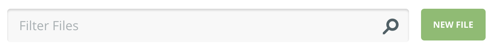
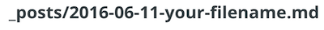
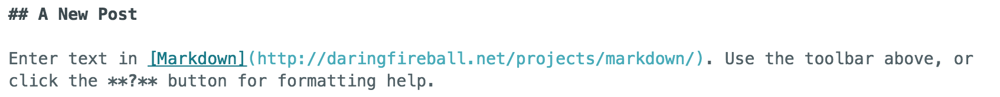
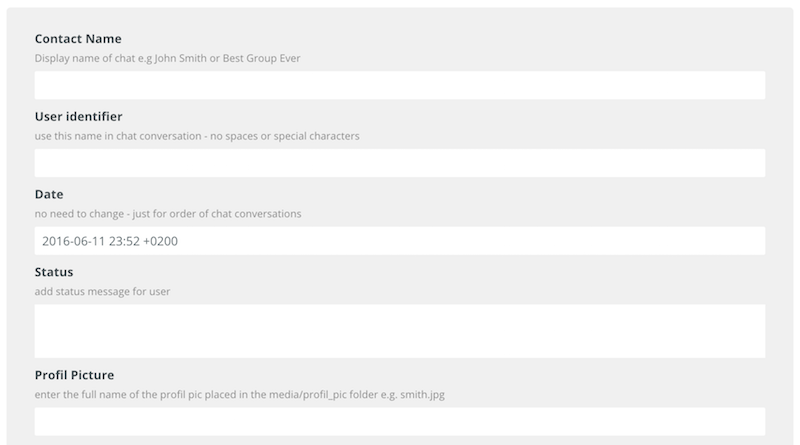
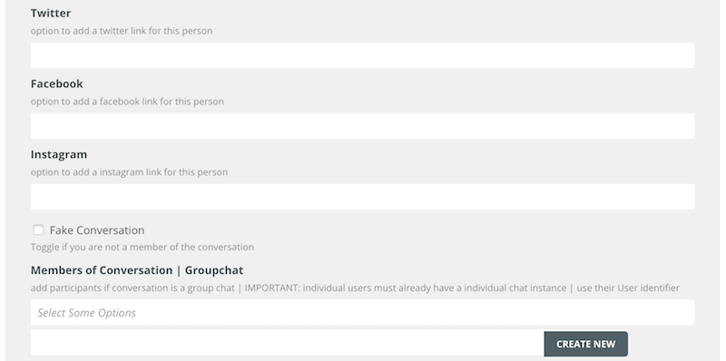
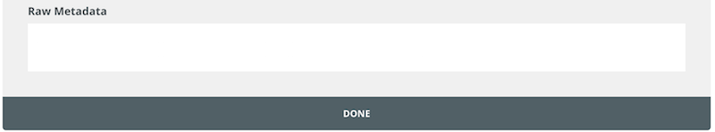
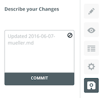
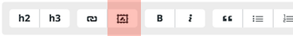
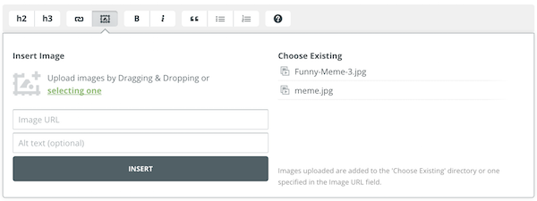

# Static Chat Blog


## How to

Make sure that you are allowed to contribute to the given project before heading over to *prose.io/\[github-username][repository-name]*.


**DIRECTORY**

```
.
├── _data
|   └── about.yml
|       contains the general information about the website like name, social
|       media links or the about section
├── _posts
|   └── contains all chat members in a individual file, as well as the
|       group conversations. Check out the yaml structure below to find out
|       which fields you could enter with some information
└── media
    ├── images
    |   default directory where all chat images are stored
    └── profil_pic
        directory where all profil pictures are stored
```


### Add a new conversation

1. Head over to http://prose.io/#\[github-username]/[repository-name]

2. switch to `_posts`

3. Use the button in the upper right corner to create a new blogpost

4. Take a look at the section in head of the new site and change `your-filename` of `_posts/2016-06-11-your-filename.md` to your title of the site.  
   
   *DON'T* change the `_post/` or the actual date `2016-06-11` part

5. If you'd like to show a About section in the Info are of your chat conversation you could now enter the desired text in the area below. Otherwise please delet the placeholder text.
   

6.  Use the marked button to open up the settings section where you could add a all of the needed information for the individual chat view as well as the actual conversation.

7. Fill the form
   
   ​

   | title            | description                              |
   | ---------------- | ---------------------------------------- |
   | contact name     | the full name you would like to display in the head of your conversation (full name of the participant) |
   | user  identifier | a short identifier you would like to use in the chat conversation |
   | date             | automatically added (there is normaly no need to change the given value) |
   | status           | if you'd like to show a user status      |
   | profil picture   | the name of the pic you added in the `media/profil_pic` directory (e.g. name.jpg) |

    
   ​

   | title                                 | description                              |
   | ------------------------------------- | ---------------------------------------- |
   | twitter                               | add a link for twitter                   |
   | facebook                              | add a link for facebook                  |
   | instagram                             | add a link for instagram                 |
   | Fake Conversation                     | toggle this if you'd like to show off a made up chat in which you aren't a member of the conversation (switches left-right of chat bubbles for every user and shows names) |
   | Members of Conversations \| Groupchat | add participants if the showed off conversation is a group chat. Use the user identifier to add new participants and make sure that the corresponding individual chat page is already created |

    
   ​

   | title        | description                              |
   | ------------ | ---------------------------------------- |
   | raw metadata | add the actual chat history (check out format below) |

   ```
   conversations:
      - DD.MM.YYYY, hh:mm - USER_IDENTIFIER - YOUR CHATMESSAGE
      - DD.MM.YYYY, hh:mm - USER_IDENTIFIER - YOUR CHATMESSAGE
   ```

   for example

   ```
   conversations:
      - 10.06.2016, 20:15 - UserA - Hey, my dear friend. How are you?
      - 10.06.2016, 20:17 - UserB - Thank you very much UserA. I am finde, what about you?
   ```

8. After entering all your content and updating your blog successfully you just need to safe the new post.
   Click on the floppy disk symbol and "commit" your update.  
     

9. You're done! :)


### Additional information

#### Upload a image

To upload a image go to *any* possible blog post in your `_post` section and click on the framed picture in the text formatting bar.  


Use the `selecting one` option to choose the desired image and keep the path that will show up in the `Image URL` if the picture is an image that should be presented in the chat history.
 
Select `INSERT`, remember the name of the picture and  delete the upshowing text in the main text area. Head over to the chat history and add the picture name in the following format:

```
- DD.MM.YYYY, hh:mm - USER_IDENTIFIER - img NAME_OF_PICTURE
```

e.g.

```
- 10.06.2016, 20:15 - UserA - img funny_cat.jpg
```

*If you'd like to upload a profile picture use the same way, but change the path of the uploading directory from `media/images` to `media/profil_pic`. Dont't forget to delete the appearing text after you click `INSERT` and include the name of the picture (e.g. `my_face.jpg`) in the profil picture settings field afterwards.* **and don't forget to save with a `COMMIT` after you did some changes** 


#### Add some specific data to your site

The `_data` section in your blog allows you to add some data like the name or some social media links to your site.


| title         | description                              |
| ------------- | ---------------------------------------- |
| title         | the title of the website                 |
| about         | some content that describes your blog    |
| facebook      | facebook link                            |
| twitter       | twitter link                             |
| instagram     | instagram link                           |
| profil_pic    | add the profit_pic like explained above  |
| tooltip_left  | the text that gets displayed if you move your mouse above the little messaging symbol in the upper left corner |
| tooltip_right | the text that gets displayed if you move your mouse above the little paperclip symbol in the upper right corner |


#### Various

* your chat conversations won't show up in your chat list on the left hand side if there are no messages in the chat history